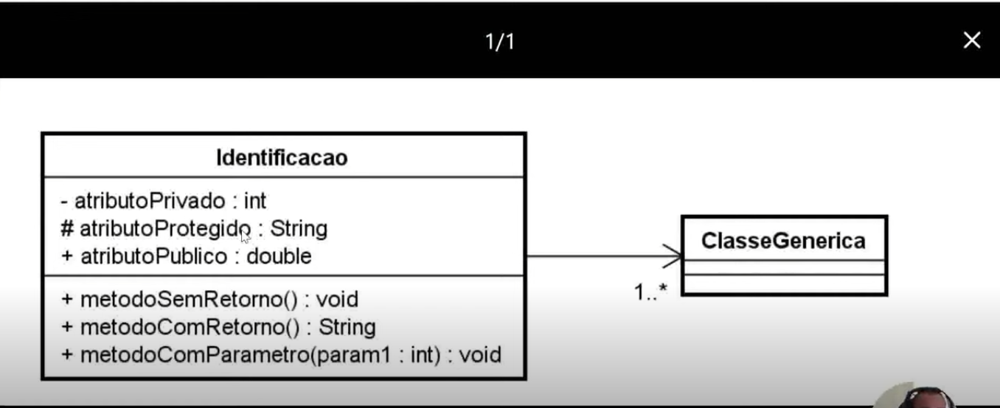

# UML
Linguagem de Modelagem Unificada ou UML é uma notação que possibita representação gráfica do projeto.

As notações UML são distribuidas em duas categorias e diagramas:

### Diagramas estruturais
- **Diagramas de classe:** Representa estruturas de classe de negócio, interface e outros componentes do sistema. É considerado o mais importante para a UML, pois auxilia na maioria dos demais.

- **Diamgrama de ojetos:** Representa os objetos existentes em um determinado instante ou faot na aplicação.
Nos ddá um perspectiva do estado de nossos objetos mediante a interação dos usuários no sistema.

- **Diagrama de classe:** Ilustra graficamente como classes serão estruturadas e interligadas entre si diante da proposta do nosso software.
Em diagrama a estrutura de classe é constituida por: 
- **Identificação:** Nome/finalidade da classe
- **Atributos:** Propriedades/caracteristicas
- **Operações:** Ações/métodos.

**Relacionamentos**
Em um diagrama as classes podem ixistir de forma independente, mas obviamente haverá uma relação com outra classes em algum momento da aplicação. 
O que devemos compreender é o nível de dependencia entra elas:

**Associação**
Define o relacionamento entre duas classes, permitindo que um objeto tenha acesso a estrutura de um outro objeto.

**Associação simples:** Navegação de A para B

`Classe A => Classe B`

**Associação bilateral:**

`Classe A <=> Classe B`

**Agragação:**

`Classe A <>=> Classe B`
A classe principal contém uma relaçã com outra classe, mas ela pode exisitir sem a classe agregadora. 
Ex: Em um cadastro de candidatos, podemos encontrar candidatos que ainda nao possuam um Profissão.

**Composição:**

`Classe A <*>=> Classe B`
Caracteriza um dependência existencial entre a classe principal e a classe associada. Imagine que uma Admissão só poderá existir contendo suas informações básicas e a composição do candidato selecionado.

**Multiplicidade**
Nem sempre a relação entre classes será de um pra uma, um determinado cenário poderá exigir multiplicidades.
- `1.` : Representa uma associação contendo um elemento.
- `*.` : Representa uma associação contendo uma lista de elementos.
- `0..1` Representa uma associação contendo 0 ou 1 elemento.
- `0..*` Representa uma associação contendo 0 ou uma lista de elementos
`1..*` Representa uma associação contendo 1 ou uma lista de elementos

**Visibilidade**
- `+` : publico.
- `#` : Protected
- `-` : Privado

### Diagramas comportamental