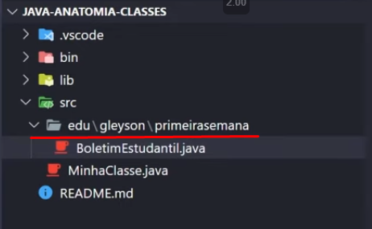

# Java Básico

## Anatomia das Classes
<details>
<summary>Anatomia de classes - 1</summary> 

- Toda classe precisa estar dentro do `src`
- Nome de classe começa com letra maiúscula
- A classe que executará o projeto precisa ter o método `public static void main(String[] args)`

- `System.out.println("conteúdo aqui")` comando para mostrar um conteúdo no terminal
</details>


<details>
<summary>Nome de variáveis</summary>

### Nome de variáveis
  -  começam com letra minusculas;
  - não iniciam com numeros;
  - não contem espaços;
  - não podem ser palavras reservadas (do, for, int, double, if);
  - uma variável não pode se repetir dentro do escopo;
  - variaveis todas em maiusculas indicam que se valor não será alterado. Utilizamos `final` para que esse valor não mude. 
    - ex: `final String BR = "Brasil";`
    - ex: `final double PI = 3.14;` 
  - Unicos caracteres especiais permitidos são `$, _`
    - `int numero_um = 1;`
    - `int numero$um = 1;`

</details>

<details>
  <summary>Declaração de variáveis e métodos</summary>

  ### Declaração de variáveis e métodos

Como identificar entre declaração de variáveise métodos em nosso programa? Existe uma estrutura comum para ambas as finalidades.
  Ex:
  - Declarar uma variável em java segue sempre a seguinte estrutura:
  `tipo nomeBemDefinido = atribuição` // opcional em alguns casos
    - `int idade = 23;`
    - `double altura = 1.77;`
    - `String nome = "Walassi";`
    - `String email;` // a atribuição não foi feita
    - `Dog spike;` // Dog é um objeto de uma classe. spike foi instanciada, mas não tem valor atribuido
  
  - Declarando métodos em java:
    `tipoDeRetorno nomeObjetivoNoInfinitivo (parametros)` 
    - `float somarRenda (float salario, float rendaExtra)`
    - `String formatarCep(long cep)`
    - exemplo de uso completo
      ```
      public static String nomeCompleto(String nome, String sobrenome)
      {
        return (nome.concat(" ").concat(sobrenome)); 
      } 

      String nome = "José";
      String sobrenome ="Silva";

      String nomeCompleto = nomeCompleto(nome, sobrenome);
      System.out.printnl(nomeCompleto);
      ```

</details>

<details>
  <summary>Identação</summary>

  ### Identação
  É a forma de organizar o código hierarquicamente para nos dá um melhor entendimento.

  obs: para algumas linguagens identação não altera o resultado do código (c#, Java, JavaScript). 

  Para outras já afeta seu funcionamento (python).

  Código com identação
  


  Código sem identação
  

</details>

<details>

<summary>Organização de arquivos</summary>

À medida que nosso sistema evolui, surgem novos arquivos e isso pode ficar grande, e confuso. Por isso temos que organizá-lo em packages

### Criar organização/packages

Existe uma convenção para criar packages
os subdiretorios usam o seguimento da empresa, nome, objetivo final:

Os segimentos são: 
- com (comercial)
- org (organizacional)
- opensource
- edu (podemos usar para educação)

Agora basta criar a pasta com estrutura e organizar de acordo.

Ex:
- `com.hypertech.notification`
- `com.hypertech.notification.app`
- `edu.walassi.tema.logica`
- `edu.walassi.primeirasemana`

### Criar organização no VSCode

No VSCode é iremos criar uma pasta com o nome completo separado por `.`, iremos criar pastas para cada nível

   

### Utilizando o package

Agorar que o package foi criado, basta chama-lo no início do arquivo para usá-lo
 

</details>


<details>

<summary>Java Beans</summary>

A fim de escrever um código que seja claro, entendido por todos envolvidos, a linguagem Java suegere através de convenções, formas de escrita universao para nossas classes, atributo, métodos e pacotes.
 #### Variáveis
- Variáveis devem ser claras, sem abreviações ou definições sem sentido;
- Variáveis sempre serão no singular para coisas no singular;
- Para array e coleções serão no plural
- Defina um idioma unico para suas variáveis

#### Métodos
- Sempre no imperativo (indicam uma ação)
  - `somar()`
- Seguindo o padrão camelCase
  - `somarNotas()`
- Ter uma finalidade só
  - `calcularImprimir()` (uso incorreto. Tem duas finalidades, fica dúbio sua função)

</details>

<details>

## Tipos e Variáveis
<summary>Tipos e Variáveis</summary>

</details>


<!-- <details>

<summary></summary>

</details> -->