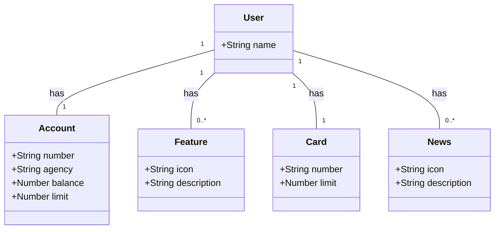

# Santander Bootcamp

Java RESTful api criada para o bootcamp Santander

```mermaid
classDiagram
    class User {
        +String name
    }

    class Account {
        +String number
        +String agency
        +Number balance
        +Number limit
    }

    class Feature {
        +String icon
        +String description
    }

    class Card {
        +String number
        +Number limit
    }

    class News {
        +String icon
        +String description
    }

    User "1" -- "1" Account : has
    User "1" -- "0..*" Feature : has
    User "1" -- "1" Card : has
    User "1" -- "0..*" News : has
```