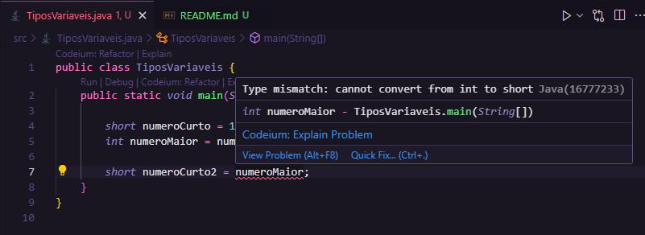

# Tipos e Variáveis

<details>

<summary>Tipo de dados</summary>

Quando vamos atribuir uma valor a alguma variável, temos que deixar explícito qual é o tipo dessa variável. Para isso temos 8 tipo primitivos, sendo eles:

- int
- byte
- short
- long
- fload
- double
- boolean
- char

Esses tipos ficam armazenados na "memory stack"

### Declaração de variáveis

Variável é uma identificação de um espaço em memória utilizaod pelo nosso programa. Seguindo as convenções em liguagem de programação, toda variável é composta por:
`<tipoDeDados> <identificação> = <valorAtribuído>`. O valor atribuído pode ser declarado na intancia ou posteriormente em alguns casos
`byte idade = 25;`
`int anoFormacao;`
`long cpf = 32132132100L;`
`float pi = 3.14f;`
`double salario = 1235.78;`
atenção: numeros iniciados com 0, o proprio 0 não conta, nesse caso, se não tiver uma operação matemática envolvida, vale a pena usar string no lugar de tipos numéricos.

- Variavéis de tipos menores podem ser atribuídas e até convertidas para tipos maiores implicitamente, mas o reverso pode gerar problema pois um numero grande não cabe em um tipo numérico menor.

- Para fazer essa converção, usamos o casting
 ex: 
 ```
 short numeroCurto = 1;
 int numeroMaior = numeroCurto;
 short numeroCurto2 = (short) numeroMaior;

 ```
</details>

<details>
<summary>Variáveis x Constantes</summary>

Variáveis podem ter seu valor reatribuído, contanto que isso não inflinja sua tipagem.

Mas nem sempre precisamos alterar o valor de uma variável. Para isso usamos constantes.
Atribuímos a ela o palavra `final` e usamos caixa alta
ex:
- `final double PI = 3.14;`
- `final  BR = "brasil";`

### Atenção
Note que não foi passado o tipo string nos tipos primitivos. String é um tipo que vem da Classe String, que é uma sequencia de chars.

</details>
